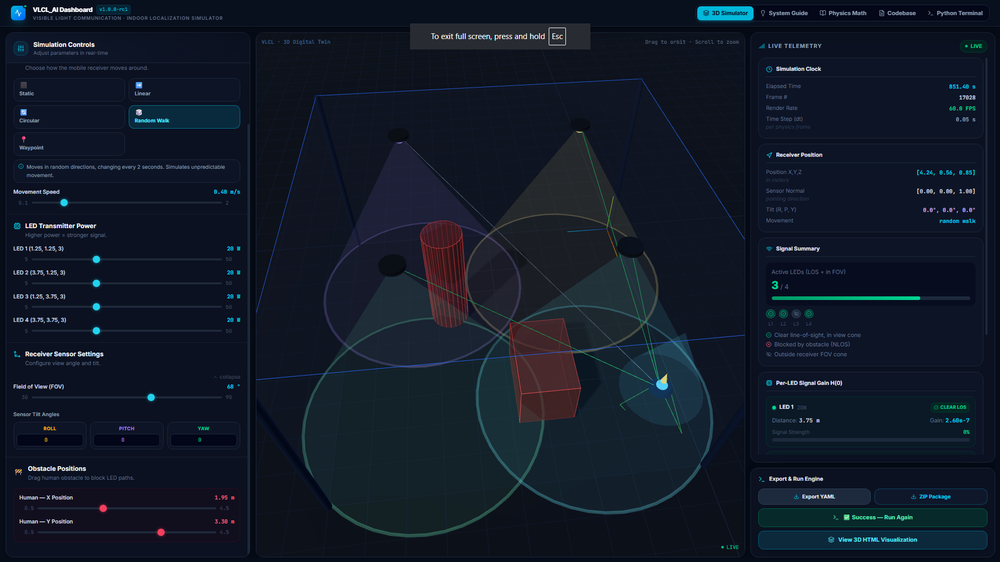

# High-Fidelity 3D Digital Twin: Integrated Visible Light Communication & Localization (VLCL)

This repository houses a high-fidelity **3D Digital Twin and Physics Simulation Engine** developed to study and test **Integrated Visible Light Communication and Localization (VLCL)** inside indoor environments.

The project has been refactored into a decoupled **monorepo workspace** with isolated Frontend (React/Vite) and Backend (Express/Python) environments.

---



## 🛠️ System Architecture

The application separates UI representation, network capabilities, and raw physics simulations into modular layers:

```
                      +------------------------------------------+
                      |         React 19 SPA Frontend           |
                      |   (Vite, ThreeJS, Tailwind, Lucide)      |
                      +-------------------+----------------------+
                                          |
                                          | HTTP REST Checks
                                          | (Proxy: /api -> localhost:3001)
                                          v
                      +-------------------+----------------------+
                      |          Express Server backend          |
                      |        (Node TS, tsx, esbuild)           |
                      +-------------------+----------------------+
                                          |
                                          | Child Process (exec)
                                          | Python .venv Router
                                          v
                      +-------------------+----------------------+
                      |      VLCL Physics Simulator Engine       |
                      |  (NumPy, SciPy, Loguru, Rich, Plotly)    |
                      +------------------------------------------+
```

### 1. Frontend (`/frontend`)

* **Technologies**: React 19, Vite, TypeScript, Three.js, TailwindCSS.
* **Responsibility**: Presents the interactive 3D digital laboratory environment. It visualizes normal vectors, light emission cones, mobile receiver vectors, and ray-casted Line-Of-Sight (LOS) obstruction vectors. It synchronizes changes to simulation parameters and shows live simulation logs inside an in-browser retro-monospace console.
* **Vite Configurations**: Proxies `/api` network calls to the Node server (port 3000/3001) during standalone client hot-reloading workouts.

### 2. Backend Server (`/backend`)

* **Technologies**: Axios/Express, TypeScript, esbuild.
* **Responsibility**: Integrates client requests, hosts compiled static SPA files with Vite middleware, and handles core subprocess execution:
  * **YAML Config REST**: Reads/Writes default configuration presets from disk (`VLCL_AI/configs/default.yaml`).
  * **Subprocess Execution Router**: Executed from either root or backend folders, it automatically scans for isolated virtual Python environments (`backend/.venv/bin/python3`) and invokes the simulator engine safely.

### 3. Simulation AI Core (`/backend/VLCL_AI`)

* **Technologies**: Python 3, NumPy, SciPy, PyYAML.
* **Responsibility**: Calculates physical properties of the room and generates logs and 3D digital twin output assets.

---

## 🔬 Mathematical & Simulation Model

The python engine (`VLCL_AI`) executes mathematical calculations to simulate optical wireless communication paths:

### 1. Room Geometry and Reflectivity

The indoor space is defined as a bounding box ($W \times L \times H$). Walls, ceilings, and floors are defined with specific reflection surface coefficients ($\rho_W, \rho_C, \rho_F$). These values determine multi-path reflections (Non-Line-Of-Sight path logs).

### 2. Transmitter (ceiling-mounted LEDs)

Each LED transmitter acts as a lambertian emitter. The emission radiation profile is characterized by its **Lambertian Order** $m$, calculated from the semi-angle emission beam ($\theta_{1/2}$):

$$
m = \frac{-\ln(2)}{\ln(\cos(\theta_{1/2}))}
$$

The LED projects optical radiation down with power output ($P_{tx}$), subcarrier frequency modulation, and DC bias values.

### 3. Optoelectronic Receiver Node

The mobile photodiode platform features:

* **Active Area ($A_{apd}$)**: Physical capture plane size in $m^2$.
* **Semi-angle Field of View ($\text{FOV}$)**: Evaluates reception capability. If the incident angle of incoming light beams exceeds the FOV boundary, signal reception drops to $0.0$.
* **Optical Path Gain**: Incorporates ambient noise levels ($W/\text{Hz}$) to measure Signal-to-Noise Ratio (SNR) in decibels:

$$
\text{SNR}_{\text{dB}} = 10 \log_{10}\left( \frac{\text{Signal Power}^2}{\text{Noise Power}} \right)
$$

### 4. Geometry and Line-Of-Sight Channel Loss

The simulator calculates the **Lambertian Direct Current Optical Gain ($H(0)$)**:

$$
H(0) = \begin{cases} 
\frac{(m + 1) A_{apd}}{2\pi d^2} \cos^m(\phi) g(\psi) \cos(\psi) & \text{if } 0 \le \psi \le \text{FOV} \\ 
0 & \text{if } \psi > \text{FOV} 
\end{cases}
$$

Where:

* $d$: Euclidean distance between Transmitter (Tx) and Receiver (Rx).
* $\phi$: Angle of irradiance relative to the transmitter normal vector.
* $\psi$: Angle of incidence relative to the receiver normal vector.
* $g(\psi)$: Optical concentrator gain.

### 5. Obstacles & Ray Tracing Blockage

Physical obstacles (like cylinders representing researchers or partitions) are registered inside the environment. The engine uses 3D analytical geometry to test line segments for intersections. If a ray intersects an obstacle, it logs a **Line-of-Sight (LOS) blockage** for that specific light path, automatically dropping $H(0)$ to zero and calculating NLOS reflections if enabled.

---

## ⚡ Execution and Interface Commands

The workspace provides workspace-wide scripts via `package.json` to handle installs and builds across both folders:

### 1. Installations

Install dependencies for both frontend and backend sub-packages in one command:

```bash
npm install
```

### 2. Running local Development Server

To launch the integrated server (Express serving hot-reloading client via middleware):

```bash
npm run dev
# Or run on an alternative port:
PORT=3001 npm run dev
```

### 3. Setup Virtual Environment (Recommended for Simulator Backend)

To isolate dependencies for the Python simulation engine:

```bash
# 1. Create venv inside public backend root
python3 -m venv backend/.venv

# 2. Install numpy, scipy, loguru, rich, plotly
backend/.venv/bin/pip install -r backend/VLCL_AI/requirements.txt
```

The server will automatically route simulation requests to the virtual environment once `.venv` is present on disk.

### 4. Build Targets

To generate optimized production bundles:

```bash
# Build React static files and Node server script
npm run build
```

* Frontend files are built into `frontend/dist/`.
* Backend is compiled into `backend/dist/server.cjs` by **esbuild**.

---

## 📁 Key File Map

* `frontend/src/App.tsx`: Main React page containing Three.js scene setup and API event handlers.
* `frontend/vite.config.ts`: Proxy settings and development configurations.
* `backend/server.ts`: Express application handling HTTP routing and python subprocesses.
* `backend/VLCL_AI/examples/demo_environment.py`: Executable Python entry script running the timeline loop.
* `backend/VLCL_AI/environment/config.py`: Loads and parses `default.yaml` into structured configurations with decimal notations.
* `backend/VLCL_AI/environment/geometry.py`: Physics vector computations and Lambertian gain math.
* `backend/VLCL_AI/environment/obstacle.py`: Ray-tracing mathematical obstacle intersection logic.
* `backend/VLCL_AI/environment/receiver.py`: Noise computations and movement calculations.
